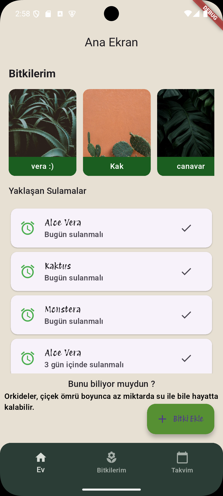
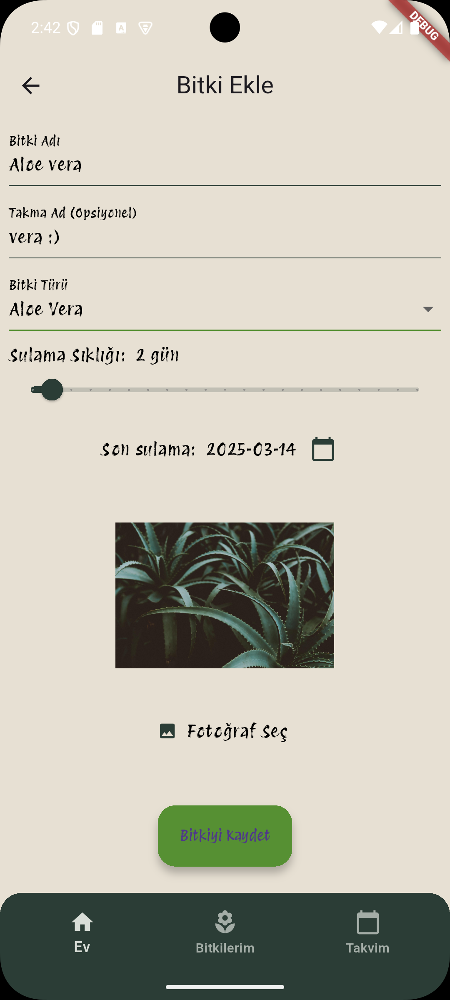
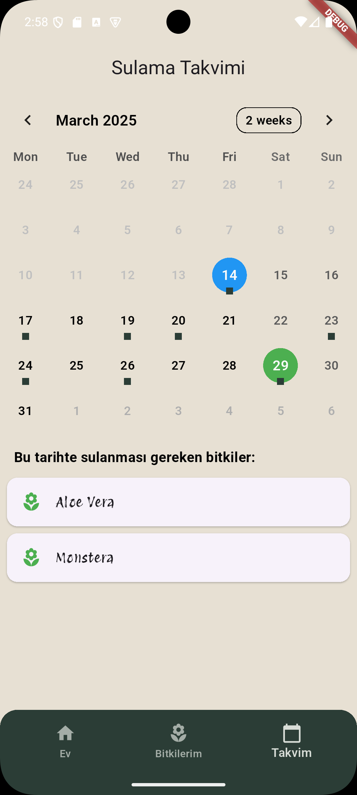
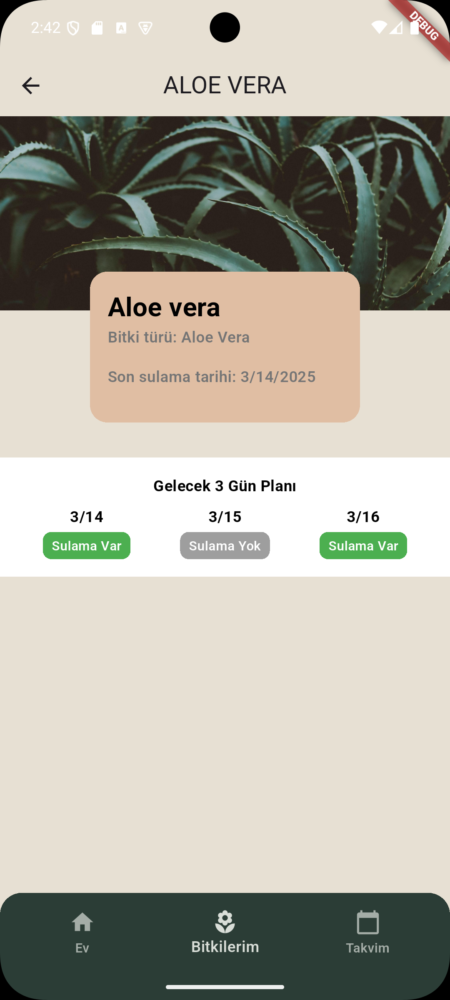
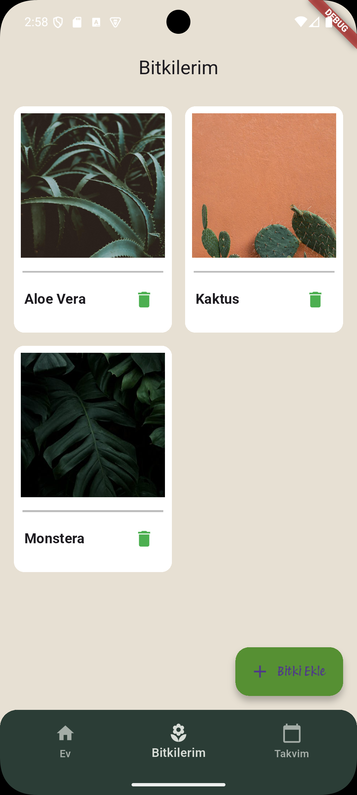

# Plant Care App

A Flutter application designed to help users track and care for their plants. The app allows you to add new plants, manage watering schedules, view upcoming watering events on a calendar, and more.

---

## Table of Contents

1. [Features](#features)
2. [Screenshots](#screenshots)
3. [Tech Stack](#tech-stack)
4. [Folder Structure](#folder-structure)
5. [Contributing](#contributing)

---

## Features

- **Add & Manage Plants**  
  - Add new plants with name, nickname, type, and image.
  - Set watering frequency and last watered date.
  - View a grid/list of your plants with detailed plant cards.

- **Watering Calendar**  
  - View upcoming watering events in a monthly calendar.
  - Check specific dates for watering tasks.
  - Interactive calendar with day selection and event loading.

- **Image Picker**  
  - Choose images for your plants using camera or gallery.
  - Responsive image preview that scales with device size.

- **State Management & Navigation**  
  - Uses Bloc/Cubit for predictable state management.
  - GoRouter is used for seamless navigation between screens.
  - Hive is utilized as a local database for storing plant data.

- **Theming**  
  - Supports both light and dark themes.
  - Custom app themes defined in the project.

---

## Screenshots

| Home Screen               | Add Plant                | Calendar               | Plant Details            |My Plants
|---------------------------|--------------------------|------------------------|--------------------------|--------------------------|
|  |  |  |  |  |


---

## Tech Stack

- **Flutter & Dart**: The core framework and language.
- **Hive**: Lightweight local database for plant data.
- **Bloc/Cubit**: For state management.
- **GoRouter**: For navigation and routing.
- **TableCalendar**: Calendar widget for displaying watering schedules.
- **ImagePicker**: To capture images from camera or gallery.

---
## Folder Structure

```bash
lib
 ┣ core
 ┃ ┣ constants       // App-wide constants (colors, paddings, strings, etc.)
 ┃ ┣ cubit           // Cubit/BLoC classes for state management
 ┃ ┣ provider        // Provider factories (e.g., watering_provider.dart)
 ┃ ┣ repository      // Data repositories (Hive and network access)
 ┃ ┣ router          // App routing configuration (GoRouter)
 ┃ ┣ theme           // App theme files (light/dark themes)
 ┃ ┗ widgets         // Reusable widgets across the app
 ┗ features
   ┣ models          // Data models (e.g., Plant)
   ┣ widgets         // Feature-specific widgets (e.g., plant cards, calendars, image pickers)
   ┗ pages           // Screens for each feature (e.g., AddPlantScreen, CalendarScreen, MyPlantsScreen)

---
## Contributing
## Any contributions,suggestions are fully welcome!!
